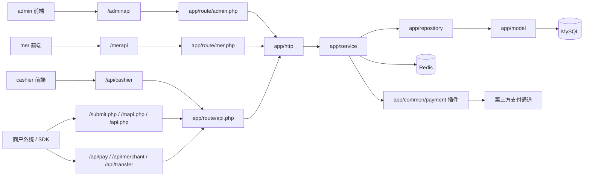

# 架构与请求流

## 工作区结构

```text
MPAY_V2/
  admin/      管理后台前端
  mer/        商户后台前端
  cashier/    收银台前端
  mpay/       Webman 后端
  docs/       当前文档中心
```

## 请求入口



## 后端分层

| 层 | 目录 | 职责 |
| --- | --- | --- |
| 路由 | `app/route`、`config/route.php` | 绑定 URL、页面入口和中间件 |
| HTTP | `app/http` | 控制器、鉴权中间件、参数校验 |
| 服务 | `app/service` | 业务规则、状态流转、插件调用、通知、清算 |
| 仓库 | `app/repository` | 数据库读写封装 |
| 模型 | `app/model` | 表映射、类型转换、时间序列化 |
| 公共能力 | `app/common` | 基类、常量、工具、中间件、支付插件 |

## 关键进程

- `webman`：HTTP 服务，监听 `0.0.0.0:8787`。
- `payment-runtime`：支付运行时维护进程，负责商户通知重试、支付单超时扫描和支付中订单主动查单。
- `monitor`：开发环境文件监控和自动重载。

## 关键约束

- `config/route.php` 显式加载 `admin.php`、`mer.php`、`api.php`，并关闭默认路由。
- 管理后台和商户后台分别使用 `AdminAuthMiddleware`、`MerchantAuthMiddleware`。
- CORS 由 `app/common/middleware/Cors` 处理。
- 前端请求前缀在各自 `src/api/index.ts` 中集中拼接，不在页面里散写。
