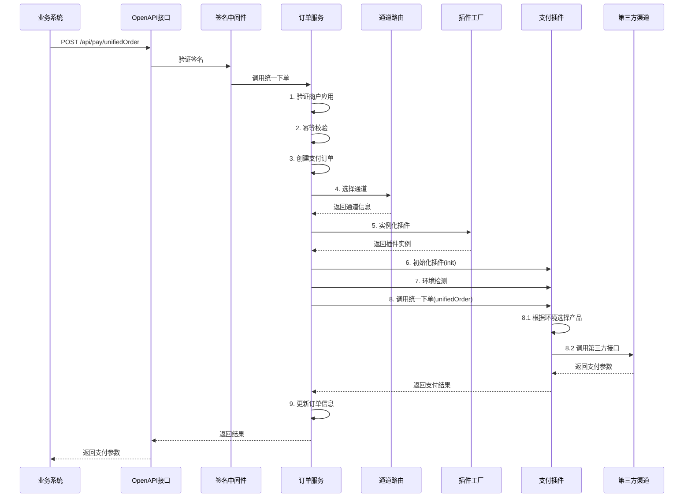

# 支付订单发起流程说明

## 一、业务系统调用统一下单接口

### 1. 接口地址
```
POST /api/pay/unifiedOrder
```

### 2. 请求头（签名认证）
```
X-App-Id: app001                    # 应用ID
X-Timestamp: 1704067200             # 时间戳（Unix秒）
X-Nonce: abc123xyz                  # 随机字符串
X-Signature: calculated_signature   # 签名（HMAC-SHA256）
Content-Type: application/json
```

### 3. 签名算法

**待签名字符串**：
```
app_id={app_id}&timestamp={timestamp}&nonce={nonce}&method=POST&path=/api/pay/unifiedOrder&body_sha256={body_sha256}
```

**计算签名**：
```php
$bodySha256 = hash('sha256', json_encode($requestBody));
$signString = "app_id={app_id}&timestamp={timestamp}&nonce={nonce}&method=POST&path=/api/pay/unifiedOrder&body_sha256={bodySha256}";
$signature = hash_hmac('sha256', $signString, $appSecret);
```

### 4. 请求体示例

```json
{
    "mch_order_no": "ORDER202401011200001",
    "pay_method": "alipay",
    "amount": 100.00,
    "currency": "CNY",
    "subject": "测试商品",
    "body": "测试商品描述"
}
```

**字段说明**：
- `mch_order_no`：商户订单号（必填，唯一，用于幂等）
- `pay_method`：支付方式（必填，如：alipay、wechat、unionpay）
- `amount`：订单金额（必填，单位：元）
- `currency`：币种（可选，默认：CNY）
- `subject`：订单标题（必填）
- `body`：订单描述（可选）

### 5. 调用示例（cURL）

```bash
curl -X POST http://localhost:8787/api/pay/unifiedOrder \
  -H "Content-Type: application/json" \
  -H "X-App-Id: app001" \
  -H "X-Timestamp: 1704067200" \
  -H "X-Nonce: abc123xyz" \
  -H "X-Signature: calculated_signature" \
  -d '{
    "mch_order_no": "ORDER202401011200001",
    "pay_method": "alipay",
    "amount": 100.00,
    "subject": "测试商品",
    "body": "测试商品描述"
  }'
```

### 6. PHP调用示例

```php
<?php
$appId = 'app001';
$appSecret = 'your_app_secret';
$baseUrl = 'http://localhost:8787';

// 准备请求数据
$requestBody = [
    'mch_order_no' => 'ORDER202401011200001',
    'pay_method' => 'alipay',
    'amount' => 100.00,
    'subject' => '测试商品',
    'body' => '测试商品描述'
];

// 计算签名
$timestamp = time();
$nonce = uniqid();
$bodyJson = json_encode($requestBody);
$bodySha256 = hash('sha256', $bodyJson);
$signString = "app_id={$appId}&timestamp={$timestamp}&nonce={$nonce}&method=POST&path=/api/pay/unifiedOrder&body_sha256={$bodySha256}";
$signature = hash_hmac('sha256', $signString, $appSecret);

// 发送请求
$ch = curl_init();
curl_setopt($ch, CURLOPT_URL, $baseUrl . '/api/pay/unifiedOrder');
curl_setopt($ch, CURLOPT_POST, true);
curl_setopt($ch, CURLOPT_POSTFIELDS, $bodyJson);
curl_setopt($ch, CURLOPT_RETURNTRANSFER, true);
curl_setopt($ch, CURLOPT_HTTPHEADER, [
    'Content-Type: application/json',
    "X-App-Id: {$appId}",
    "X-Timestamp: {$timestamp}",
    "X-Nonce: {$nonce}",
    "X-Signature: {$signature}",
]);

$response = curl_exec($ch);
$httpCode = curl_getinfo($ch, CURLINFO_HTTP_CODE);
curl_close($ch);

$result = json_decode($response, true);
if ($httpCode === 200 && $result['code'] === 200) {
    echo "支付订单号：" . $result['data']['pay_order_id'] . "\n";
    echo "支付参数：" . json_encode($result['data']['pay_params'], JSON_UNESCAPED_UNICODE) . "\n";
} else {
    echo "错误：" . $result['msg'] . "\n";
}
```

## 二、服务端处理流程

### 流程图



### 详细步骤说明

#### 步骤1：签名验证（中间件）
- `OpenApiAuthMiddleware` 验证请求头中的签名
- 验证时间戳（5分钟内有效）
- 验证签名是否正确
- 将应用信息注入到请求对象

#### 步骤2：验证商户应用
- 根据 `app_id` 查询 `ma_merchant_app` 表
- 检查应用状态是否启用

#### 步骤3：幂等校验
- 根据 `merchant_id + mch_order_no` 查询是否已存在订单
- 如果存在，直接返回已有订单信息（支持幂等）

#### 步骤4：创建支付订单
- 生成支付订单号（格式：`P20240101120000123456`）
- 创建 `ma_pay_order` 记录
- 状态：`PENDING`（待支付）
- 过期时间：30分钟后

#### 步骤5：通道路由选择
- 根据 `merchant_id + app_id + method_code` 查找可用通道
- 从 `ma_pay_channel` 表中查询
- 选择第一个可用的通道（后续可扩展权重、容灾策略）

#### 步骤6：实例化插件
- 在 `PayService` 中根据 `ma_pay_plugin` 注册表解析插件：优先使用表中的 `class_name`，否则按约定使用 `app\common\payment\{Code}Payment` 实例化插件
- 例如：`plugin_code = 'lakala'` → 实例化 `LakalaPlugin`

#### 步骤7：初始化插件
- 调用 `$plugin->init($methodCode, $channelConfig)`
- 插件内部切换到指定支付方式的配置和逻辑
- 例如：拉卡拉插件初始化到 `alipay` 模式

#### 步骤8：环境检测
- 从请求头 `User-Agent` 判断用户环境
- 环境类型：
  - `PC`：PC桌面浏览器
  - `H5`：H5手机浏览器
  - `WECHAT`：微信内浏览器
  - `ALIPAY_CLIENT`：支付宝客户端

#### 步骤9：调用插件统一下单
- 调用 `$plugin->unifiedOrder($orderData, $channelConfig, $env)`
- 插件内部处理：
  1. **产品选择**：从通道的 `enabled_products` 中，根据环境自动选择一个产品
     - 例如：H5环境 → 选择 `alipay_h5`
     - 例如：支付宝客户端 → 选择 `alipay_life`
  2. **调用第三方接口**：根据产品和支付方式，调用对应的第三方支付接口
     - 例如：拉卡拉插件的支付宝H5接口
  3. **返回支付参数**：返回给业务系统的支付参数

#### 步骤10：更新订单
- 更新订单的 `product_code`（实际使用的产品）
- 更新订单的 `channel_id`
- 更新订单的 `channel_order_no`（渠道订单号）
- 保存 `pay_params` 到 `extra` 字段

## 三、响应数据格式

### 成功响应

```json
{
    "code": 200,
    "msg": "success",
    "data": {
        "pay_order_id": "P20240101120000123456",
        "status": "PENDING",
        "pay_params": {
            "type": "redirect",
            "url": "https://mapi.alipay.com/gateway.do?..."
        }
    }
}
```

### 支付参数类型

根据不同的支付产品和环境，`pay_params` 的格式不同：

#### 1. 跳转支付（H5/PC扫码）
```json
{
    "type": "redirect",
    "url": "https://mapi.alipay.com/gateway.do?xxx"
}
```
业务系统需要：**跳转到该URL**

#### 2. 表单提交（H5）
```json
{
    "type": "form",
    "method": "POST",
    "action": "https://mapi.alipay.com/gateway.do",
    "fields": {
        "app_id": "xxx",
        "method": "alipay.trade.wap.pay",
        "biz_content": "{...}"
    }
}
```
业务系统需要：**自动提交表单**

#### 3. JSAPI支付（微信内/支付宝生活号）
```json
{
    "type": "jsapi",
    "appId": "wx1234567890",
    "timeStamp": "1704067200",
    "nonceStr": "abc123",
    "package": "prepay_id=wx1234567890",
    "signType": "MD5",
    "paySign": "calculated_signature"
}
```
业务系统需要：**调用微信/支付宝JSAPI**

#### 4. 二维码支付（PC扫码）
```json
{
    "type": "qrcode",
    "qrcode_url": "https://qr.alipay.com/xxx",
    "qrcode_data": "data:image/png;base64,..."
}
```
业务系统需要：**展示二维码**

## 四、用户支付流程

### 1. 业务系统处理支付参数

根据 `pay_params.type` 进行不同处理：

```javascript
// 前端处理示例
const payParams = response.data.pay_params;

switch (payParams.type) {
    case 'redirect':
        // 跳转支付
        window.location.href = payParams.url;
        break;
        
    case 'form':
        // 表单提交
        const form = document.createElement('form');
        form.method = payParams.method;
        form.action = payParams.action;
        Object.keys(payParams.fields).forEach(key => {
            const input = document.createElement('input');
            input.type = 'hidden';
            input.name = key;
            input.value = payParams.fields[key];
            form.appendChild(input);
        });
        document.body.appendChild(form);
        form.submit();
        break;
        
    case 'jsapi':
        // 微信JSAPI支付
        WeixinJSBridge.invoke('getBrandWCPayRequest', {
            appId: payParams.appId,
            timeStamp: payParams.timeStamp,
            nonceStr: payParams.nonceStr,
            package: payParams.package,
            signType: payParams.signType,
            paySign: payParams.paySign
        }, function(res) {
            if (res.err_msg === "get_brand_wcpay_request:ok") {
                // 支付成功
            }
        });
        break;
        
    case 'qrcode':
        // 展示二维码
        document.getElementById('qrcode').src = payParams.qrcode_data;
        break;
}
```

### 2. 用户完成支付

- 用户在第三方支付平台完成支付
- 第三方平台异步回调到支付中心

### 3. 支付中心处理回调

- 接收回调：`POST /api/notify/alipay` 或 `/api/notify/wechat`
- 验签：使用插件验证回调签名
- 更新订单状态：`PENDING` → `SUCCESS` 或 `FAIL`
- 创建通知任务：异步通知业务系统

### 4. 业务系统接收通知

- 支付中心异步通知业务系统的 `notify_url`
- 业务系统验证签名并处理订单

## 五、查询订单接口

### 接口地址
```
GET /api/pay/query?pay_order_id=P20240101120000123456
```

### 请求头（需要签名）
```
X-App-Id: app001
X-Timestamp: 1704067200
X-Nonce: abc123xyz
X-Signature: calculated_signature
```

### 响应示例

```json
{
    "code": 200,
    "msg": "success",
    "data": {
        "pay_order_id": "P20240101120000123456",
        "mch_order_no": "ORDER202401011200001",
        "status": "SUCCESS",
        "amount": 100.00,
        "pay_time": "2024-01-01 12:00:30"
    }
}
```

## 六、完整调用示例（Node.js）

```javascript
const crypto = require('crypto');
const axios = require('axios');

class PaymentClient {
    constructor(appId, appSecret, baseUrl) {
        this.appId = appId;
        this.appSecret = appSecret;
        this.baseUrl = baseUrl;
    }
    
    // 计算签名
    calculateSignature(method, path, body, timestamp, nonce) {
        const bodySha256 = crypto.createHash('sha256').update(JSON.stringify(body)).digest('hex');
        const signString = `app_id=${this.appId}&timestamp=${timestamp}&nonce=${nonce}&method=${method}&path=${path}&body_sha256=${bodySha256}`;
        return crypto.createHmac('sha256', this.appSecret).update(signString).digest('hex');
    }
    
    // 统一下单
    async unifiedOrder(orderData) {
        const timestamp = Math.floor(Date.now() / 1000);
        const nonce = Math.random().toString(36).substring(7);
        const method = 'POST';
        const path = '/api/pay/unifiedOrder';
        
        const signature = this.calculateSignature(method, path, orderData, timestamp, nonce);
        
        const response = await axios.post(`${this.baseUrl}${path}`, orderData, {
            headers: {
                'Content-Type': 'application/json',
                'X-App-Id': this.appId,
                'X-Timestamp': timestamp,
                'X-Nonce': nonce,
                'X-Signature': signature
            }
        });
        
        return response.data;
    }
    
    // 查询订单
    async queryOrder(payOrderId) {
        const timestamp = Math.floor(Date.now() / 1000);
        const nonce = Math.random().toString(36).substring(7);
        const method = 'GET';
        const path = `/api/pay/query?pay_order_id=${payOrderId}`;
        
        const signature = this.calculateSignature(method, path, {}, timestamp, nonce);
        
        const response = await axios.get(`${this.baseUrl}${path}`, {
            headers: {
                'X-App-Id': this.appId,
                'X-Timestamp': timestamp,
                'X-Nonce': nonce,
                'X-Signature': signature
            }
        });
        
        return response.data;
    }
}

// 使用示例
const client = new PaymentClient('app001', 'your_app_secret', 'http://localhost:8787');

// 统一下单
client.unifiedOrder({
    mch_order_no: 'ORDER202401011200001',
    pay_method: 'alipay',
    amount: 100.00,
    subject: '测试商品',
    body: '测试商品描述'
}).then(result => {
    console.log('支付参数：', result.data.pay_params);
    // 根据 pay_params.type 处理支付
}).catch(err => {
    console.error('下单失败：', err.message);
});
```

## 七、注意事项

1. **幂等性**：相同的 `mch_order_no` 多次调用，返回同一订单信息
2. **签名有效期**：时间戳5分钟内有效
3. **订单过期**：订单默认30分钟过期
4. **环境检测**：系统自动根据UA判断环境，选择合适的产品
5. **异步通知**：支付成功后，系统会异步通知业务系统的 `notify_url`
6. **订单查询**：业务系统可通过查询接口主动查询订单状态

